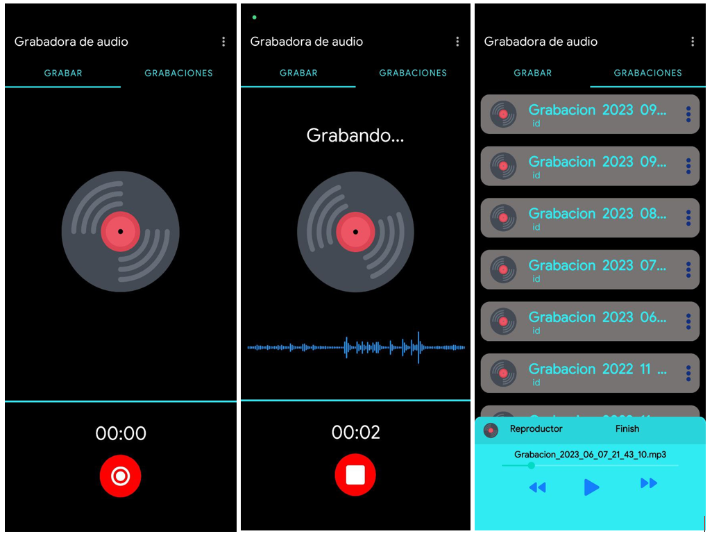

## GrabAudio - Aplicación Móvil para Grabación y Reproducción de Audio con Galería Multimedia

### Descripción del Proyecto

GrabAudio es una aplicación móvil desarrollada para dispositivos Android que permite a los usuarios grabar audio, reproducir grabaciones y gestionar una galería multimedia de imágenes y videos. La aplicación ofrece una interfaz intuitiva y fácil de usar, ideal para tomar notas de voz.

### Interfaz

